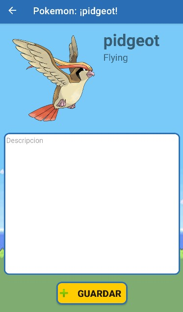

# tp-laboratorio-V
**Pokedex**
Trabajo Practico para la materia de Laboratorio de Programación V

Este proyecto está basado en el clásico Pokedex del universo de Pokemon. 

Encontraremos un listado de Pokemons ya encontrados y un listado más de los que nos falta por encontrar.

Y finalmente encontraremos el detalle de cada uno de los pokemons, donde podremos agregarle una descripción y conocerlo mas.

Esperamos que sea de tu agrado, perfecto para tu dispositivo Android.
